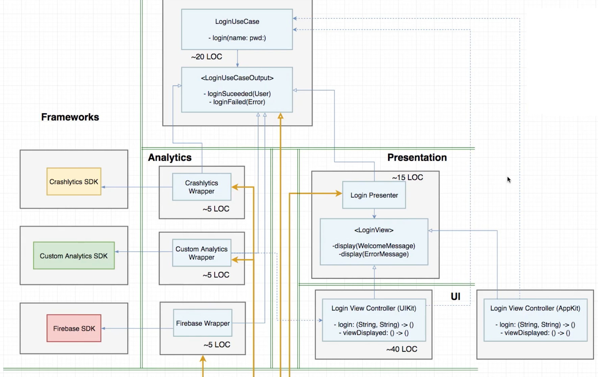

# iOS Analytics archtecture

This project makes part of my studies for the course [iOS Lead Essentials](https://iosacademy.essentialdeveloper.com/p/ios-lead-essentials/).

This project presents the implementation of the final architecture presented in the class ["Clean iOS Architecture pt.2: Good Architecture Traits"](https://www.essentialdeveloper.com/articles/clean-ios-architecture-part-2-good-architecture-traits). The objective of the implementation is to show how to decouple the analytics implementations from the other parts of the app, and make the code base more extensible and open for changes.

*The image above doesn't show the complete architecture diagram, but it can be found in the refered video.*
